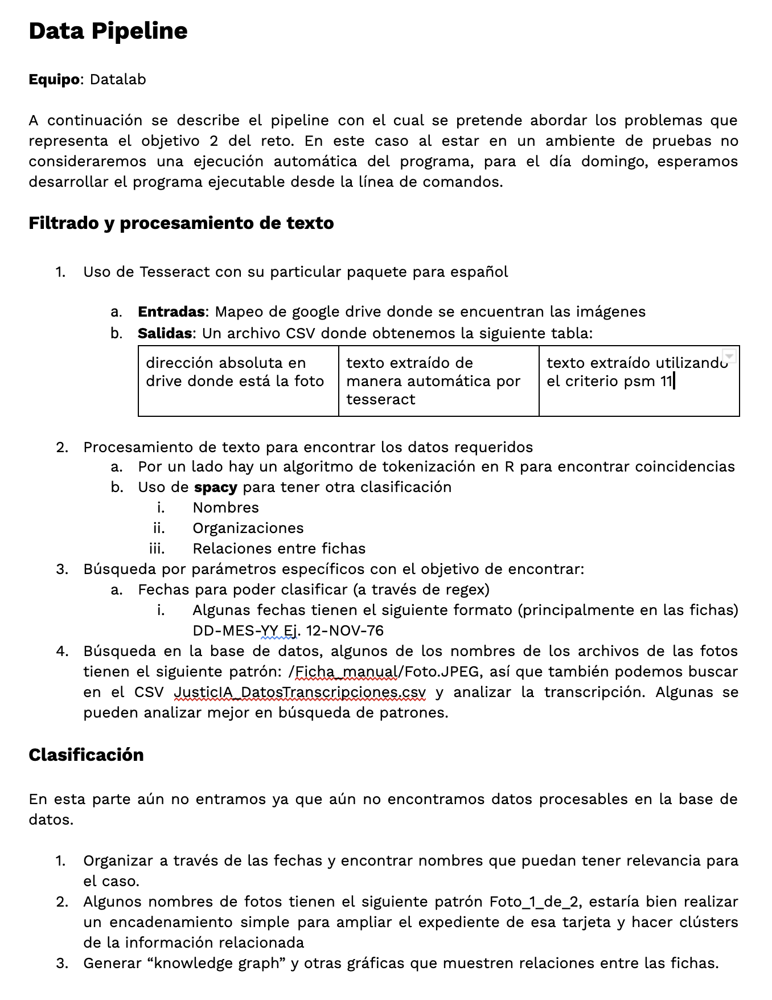

# Hackathon RIIAA 2021 "JusticIA para los desaparecidos"
## Reto 2

---

**Nombre del equipo**  
Datalab ITAM

**Integrantes**

* Majo Castañeda
* Dante Bazaldua
* Valentina Mancera

## Descripión
El proyecto se ejecuta desde el siguiente link [Google Colab](https://colab.research.google.com/drive/1yLUTgmhKIGs90-o6evDJT8GZOkTZDxKR?usp=sharing), pero se puede revisar el código en el actual repositorio.

El link a la presentación del equipo también está [aquí](https://docs.google.com/presentation/d/1OOR6nOrynTvxAvza_v398T6qMkVB-vB_uw0KjEwkbaM/edit?usp=sharing)

## Pipeline

## Cómo correr el código
Ejecutar el ipynb (el colab)

## Notas

Los resultados se encuentran en **reto2A.csv** y **reto2B.csv** que son resultado de los datos que nos proporcionaron para evaluar.

